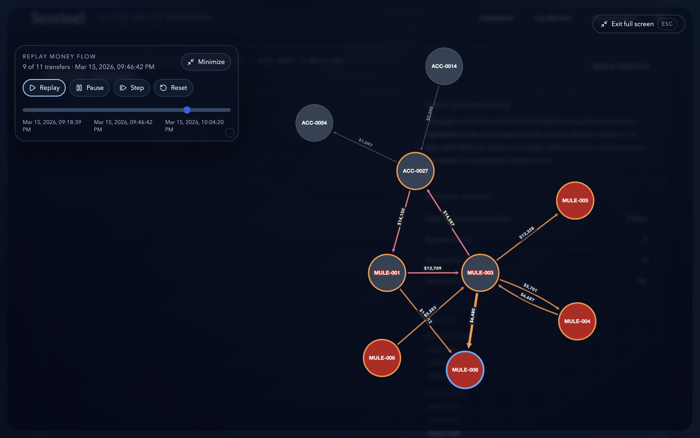

<a id="readme-top"></a>

<p align="center">
  
</p>

<h1 align="center">Sentinel</h1>

<p align="center">
  AI-native fraud defense for modern analyst teams, combining anomaly scoring, behavioral identity,
  and network intelligence in one unified workspace.
</p>

<p align="center">
  <a href="#product-preview"><strong>Product Preview</strong></a>
  ·
  <a href="#getting-started"><strong>Getting Started</strong></a>
  ·
  <a href="COMPREHENSIVE_DOCUMENTATION.md"><strong>Technical Documentation</strong></a>
  ·
  <a href="https://github.com/SarveshwarSenthilKumar/GenAI-Genesis/issues"><strong>Issues</strong></a>
</p>

<p align="center">
  
  
  
  
  
</p>

## Product Preview



<p align="center">
  <em>Current preview: a full-screen network replay view for tracing suspicious money movement and exposed mule paths.</em>
</p>

## About Sentinel

Sentinel is an AI-assisted fraud analyst workspace for detecting suspicious transfers, triaging
high-risk alerts, and investigating connected money movement in real time. It is built to show not
just that a transaction is risky, but why it was flagged, what pushed it from review to hold or
block, and how network exposure changes the investigation.

The product combines a synthetic live stream for demos, a score-first incident queue, explainable
decision logic, graph-based investigation, business-impact framing, and CSV upload analysis for ad
hoc datasets. The result is a more presentation-ready fraud console that still reads like a real
professional tool.

## Why Sentinel

- Traditional fraud tooling often scores isolated transactions well, but makes it harder to see how signals interact across behavior, device, and network context.
- Analysts need a single workspace for triage, explanation, and investigation instead of switching across separate dashboards and graph tools.
- Demo environments need reliable, repeatable fraud scenarios that still feel realistic enough to tell a strong product story.
- Sentinel addresses those gaps with anomaly scoring, deterministic rules, and network analysis inside one unified analyst workspace.

## Core Workflow

1. Detect anomalous transfers and suspicious clusters in a live synthetic stream.
2. Prioritize incidents in a queue built for triage, filtering, and scenario injection.
3. Open the triage dock to review the combined transaction, behavior, and network score breakdown.
4. Move into investigation views to trace money flow, exposed entities, and suspicious graph patterns.
5. Support the narrative with business-impact metrics, upload-based analysis, and optional AI explanations.

## Tech Stack

### Frontend

- Next.js 15
- React 19
- TypeScript
- Tailwind CSS
- Cytoscape.js
- Recharts
- React Three Fiber

### Backend

- FastAPI
- Python
- pandas
- networkx
- python-dotenv
- python-multipart

### AI and Explanation Layer

- OpenAI-compatible chat and explanation flows
- Deterministic fallback behavior when no live model is configured
- Incident and transaction chat surfaces grounded in current case data

## Getting Started

### Prerequisites

- Python 3
- Node.js and npm

### 1. Clone the repository

```bash
git clone https://github.com/SarveshwarSenthilKumar/GenAI-Genesis.git
cd GenAI-Genesis
```

### 2. Start the backend

```bash
cd backend
python3 -m venv .venv
source .venv/bin/activate
pip install -r requirements.txt
uvicorn app.main:app --reload
```

The backend runs at `http://127.0.0.1:8000`.

### 3. Start the frontend

```bash
cd frontend
npm install
npm run dev
```

The frontend runs at `http://127.0.0.1:3000`.

### 4. Configure environment variables

The backend reads from either the repo root `.env` file or `backend/.env`.

Backend example:

```env
FRONTEND_ORIGINS=http://localhost:3000,http://127.0.0.1:3000,http://localhost:3001,http://127.0.0.1:3001
OPENAI_API_KEY=
OPENAI_MODEL=gpt-4o-mini
OPENAI_TIMEOUT_SECONDS=8
OPENAI_BASE_URL=https://qyt7893blb71b5d3.us-east-2.aws.endpoints.huggingface.cloud/v1
```

Frontend example:

```env
NEXT_PUBLIC_API_BASE_URL=http://127.0.0.1:8000
```

If `NEXT_PUBLIC_API_BASE_URL` is unset, the frontend defaults to `http://127.0.0.1:8000`.

### Useful frontend scripts

- `npm run dev` starts the development server
- `npm run dev:fresh` clears `.next` and starts fresh
- `npm run reset` clears `.next`
- `npm run build` creates a production build
- `npm run start` serves the production build

## Key Routes

| Route | Purpose |
| --- | --- |
| `/` | Product landing page and analyst-console entry point |
| `/dashboard` | Incident queue, triage, filtering, and scenario injection |
| `/live` | Real-time fraud monitoring and business-impact snapshot |
| `/upload` | CSV upload flow for live-style fraud analysis |
| `/incidents/[id]` | Detailed incident investigation view |
| `/incidents/[id]/graph` | Network exposure view for a selected incident |
| `/cases/[id]` | Deterministic case-review flow |
| `/documentation` | In-app product and scoring documentation |
| `/3d-network` | Experimental 3D network visualization surface |

## Detection Architecture

Sentinel is strongest when it is shown as a complete investigation loop rather than a single score.
The backend layers several systems together:

- `Transaction scoring`: flags unusual payment amounts, velocity, and transfer behavior.
- `Behavior scoring`: captures session drift, device changes, and baseline deviations.
- `Network scoring`: detects exposure to suspicious clusters, rapid chains, fan-in/fan-out, and cash-out paths.
- `Decision transparency`: exposes the top driver, tipping point, counterfactual context, and analyst-friendly explanation.
- `AI assistance`: enhances incident and transaction review, while deterministic flows keep the core demo reliable without a live model.

Selected API surfaces that power the workspace:

- `GET /api/incidents/queue`
- `GET /api/incidents/{incident_id}/panel`
- `GET /api/incidents/{incident_id}/graph`
- `GET /api/live/bootstrap`
- `GET /api/live/stream`
- `GET /api/live/scenario`
- `POST /api/uploads/transactions/live`
- `POST /api/uploads/transactions/dashboard`

## Roadmap

- Expand the scenario library for more repeatable fraud-story demos.
- Continue refining the triage and investigation experience around explanation quality and analyst actions.
- Deepen upload-based reporting so ad hoc datasets feel as polished as the live monitor.
- Keep iterating on graph exploration, including the experimental 3D network surface.

## License and Support

- Repository: [SarveshwarSenthilKumar/GenAI-Genesis](https://github.com/SarveshwarSenthilKumar/GenAI-Genesis)
- Project summary: [PROJECT_INFO.md](PROJECT_INFO.md)
- Technical deep dive: [COMPREHENSIVE_DOCUMENTATION.md](COMPREHENSIVE_DOCUMENTATION.md)
- Issues and enhancements: [GitHub Issues](https://github.com/SarveshwarSenthilKumar/GenAI-Genesis/issues)
- License status: no license file is currently included in this repository.

<p align="right">(<a href="#readme-top">back to top</a>)</p>
